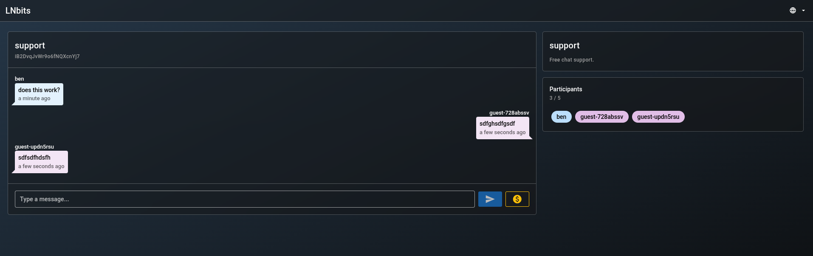
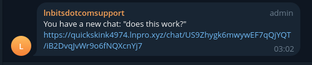
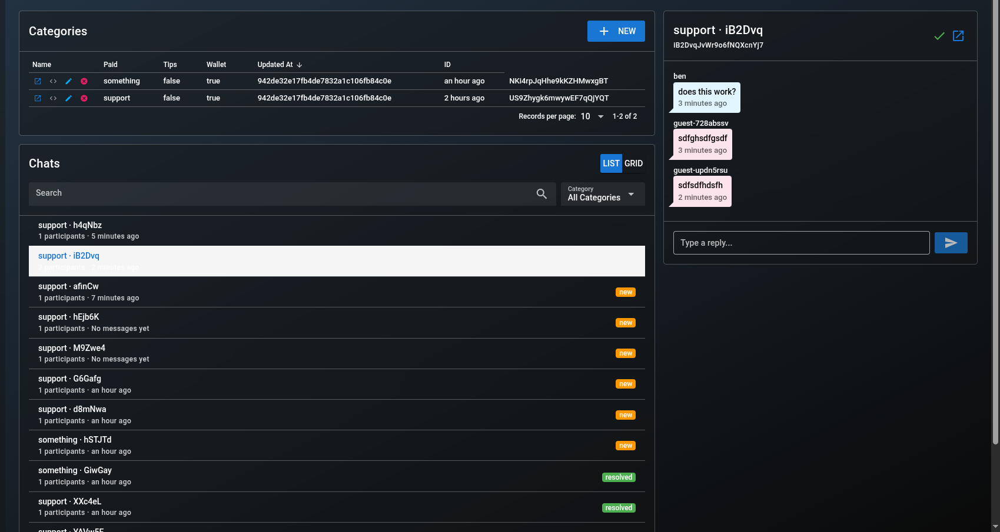
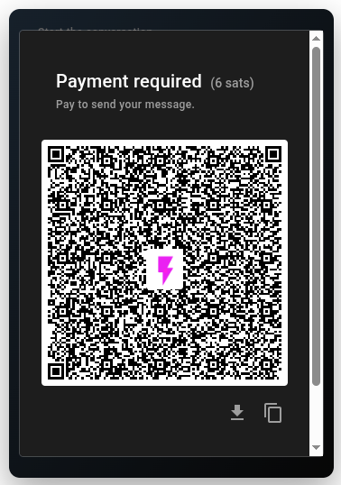
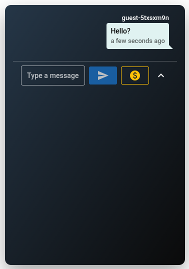

# Chat - An [LNbits](https://github.com/lnbits/lnbits) Extension

Live support chat built for LNbits. Create categories, share public chat links, and manage incoming conversations from the admin dashboard.

## Features

- Category-based public chats with shareable links and multi-participant sessions.
- Admin dashboard with list or grid view, unread/resolved indicators, and inline replies.
- Paid guest messages with per-character pricing and Lightning invoices.
- Optional tips from the public chat interface.
- Notifications for new chats (Telegram, Nostr, Email) including the first message and link.
- Embeddable widget/iframe with minimized launcher.

## Screenshots

